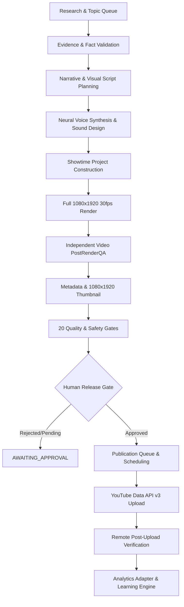

# DailyCortex 2.0 — Phase 4 Production Architecture

## 1. System Overview
DailyCortex 2.0 is an autonomous, local-first production factory for high-retention YouTube Shorts explaining cognitive science and psychology. Phase 4 extends the Phase 3A/3A.5 rendering pipeline with end-to-end evidence validation, metadata generation, standalone thumbnail rendering, YouTube Data API v3 publishing integration (disabled by default), 6-slot daily publication scheduling, analytics tracking, and continuous learning feedback.



---

## 2. Factory Durable State Machine
The production factory executes each job via an explicit, durable, 20-stage state machine with strict validated transitions persisted to `job-state.json`.

```
QUEUED
  ↓
RESEARCHING
  ↓
SCRIPTING
  ↓
PLANNING
  ↓
GENERATING_AUDIO
  ↓
ACQUIRING_MEDIA
  ↓
RENDERING
  ↓
QA_RUNNING → [QA_FAILED]
  ↓
AWAITING_APPROVAL (Human Release Gate)
  ↓
READY_TO_PUBLISH
  ↓
UPLOAD_PENDING
  ↓
UPLOADING
  ↓
UPLOADED_PRIVATE
  ↓
SCHEDULED
  ↓
PUBLISHED
  ↓
ANALYTICS_PENDING
  ↓
COMPLETED
```

### Transition Guarantees
- **Strict Legal Transitions**: An illegal jump (e.g. `RESEARCHING` → `PUBLISHED`) throws an explicit error and records a transition rejection.
- **Durable Persistence**: Every state transition atomically updates `data/jobs/<job-id>/job-state.json` with an immutable transition history audit trail.
- **Idempotent Recovery**: Completed jobs are never duplicate-rendered or duplicate-uploaded. Process restarts detect the last recorded checkpoint and resume safely.

---

## 3. Core Modules & Responsibilities

| Module | Location | Responsibility |
|---|---|---|
| **FactEngine** | `src/content/fact-engine.ts` | Audits empirical claims, checks study titles/authors/dates, flags unsupported statistics `\d+(%|percent)`, and blocks overconfident clickbait wording. |
| **TopicEngine** | `src/content/topic-engine.ts` | Curated queue of verified scientific topics (`embarrassing-memories`, `doorway-effect`, `spotlight-effect`, `zeigarnik-effect`). |
| **MetadataGenerator** | `src/publishing/metadata-generator.ts` | Creates title ($\le 60$ chars), academic citation description, hashtags, tags, and a 64-character SHA-256 content fingerprint. |
| **ThumbnailGenerator** | `src/publishing/thumbnail-generator.ts` | Builds exact 1080×1920 portrait thumbnails adhering to YouTube Shorts safe zones (margins: top 180px, bottom 360px, sides 100px). |
| **YouTubeClient** | `src/publishing/youtube-client.ts` | Production-grade YouTube Data API v3 client supporting resumable uploads, OAuth refresh, preflight size/codec checks, duplicate fingerprint protection, and remote video metadata retrieval. |
| **PublicationScheduler** | `src/publishing/scheduler.ts` | Manages durable 6-video/day publishing windows (09:00, 12:00, 15:00, 17:30, 20:00, 22:30), collision prevention, and missed schedule reconciliation. |
| **AnalyticsAdapter** | `src/analytics/analytics-adapter.ts` | Retrieves views, watch time, retention, likes, comments, and calculates age-normalized view velocity. |
| **LearningEngine** | `src/analytics/learning-engine.ts` | Synthesizes performance patterns across narrative structures, visual styles, and durations to generate evidence-based experiment recommendations. |
| **QualityGateEngine** | `src/quality/quality-gates.ts` | Audits the 20 mandatory technical, perceptual, and policy release gates before any video can be published. |
| **FactoryEngine** | `src/factory/factory-engine.ts` | Coordinates the full autonomous pipeline across jobs, batches, retries, and restarts. |

---

## 4. Hardware Suitability (MacBook Air Constraints)
- **Bounded Concurrency**: `MAX_CONCURRENT_JOBS` is set to `1` by default to prevent memory exhaustion during full 1080×1920 Puppeteer/Chrome and FFmpeg rendering.
- **Asset Caching**: Kokoro neural voice WAVs, alignment JSONs, and procedural motion plates are deterministically cached using SHA-256 hashes to prevent redundant generation.
- **Local Fallbacks**: When external APIs (Groq, Pexels) are absent, the system operates completely offline without failure or degraded output contracts.
